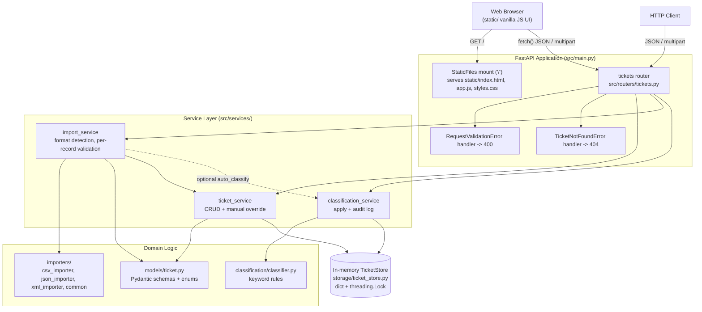
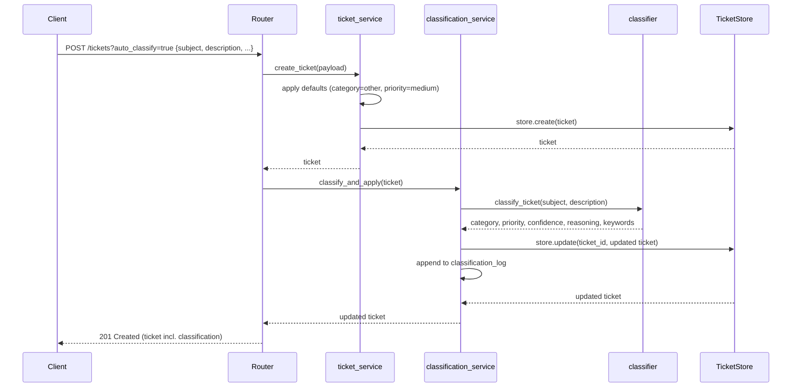
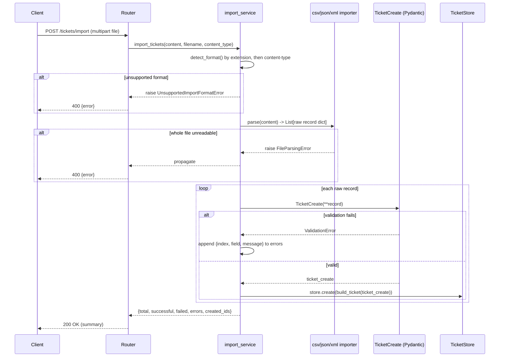

# Architecture

Audience: technical leads evaluating design decisions, trade-offs, and
non-functional characteristics of the system.

## High-Level Architecture

## Components

| Component | Responsibility |
|---|---|
| `src/main.py` | FastAPI app instance, router registration, global exception handlers that translate `RequestValidationError` → 400 and `TicketNotFoundError` → 404, and the `StaticFiles` mount serving the front-end |
| `static/` | Vanilla HTML/CSS/JavaScript single-page UI. No build step; calls the same-origin REST API via `fetch()`. Mounted at `/` *after* the API routes so it only catches paths the router doesn't already handle |
| `src/routers/tickets.py` | Thin HTTP layer: request/response wiring only, delegates to services |
| `src/services/ticket_service.py` | Ticket CRUD, applies defaults (`category=other`, `priority=medium`), detects manual category/priority overrides on `PUT` |
| `src/services/import_service.py` | Detects file format (extension, then content-type), dispatches to the matching importer, validates each parsed record independently against `TicketCreate`, and persists successes |
| `src/services/classification_service.py` | Runs the classifier, applies results to a ticket, and appends every decision to an in-memory audit log |
| `src/importers/*` | Pure parsing functions (`bytes -> List[dict]`) per format; `common.py`'s `normalize_record()` reconciles format-specific quirks (CSV's flat `metadata_*` columns, tag delimiters, empty-string "nulls") into one shape before Pydantic validation |
| `src/classification/classifier.py` | Deterministic keyword-matching for category + priority, with word-count-weighted scoring so specific multi-word phrases outrank generic single words |
| `src/models/ticket.py` | Pydantic v2 schemas (`TicketCreate`, `TicketUpdate`, `Ticket`) and all enums; single source of truth for validation rules |
| `src/storage/ticket_store.py` | In-memory `dict[UUID, Ticket]` guarded by a `threading.Lock` for thread-safe concurrent access |

## Data Flow: Create Ticket with Auto-Classification

## Data Flow: Bulk Import

## Design Decisions & Trade-offs

- **In-memory storage instead of a database.** Chosen for this assignment's
  scope: zero setup, fast tests, no migrations. Trade-off: all data is lost
  on restart and the API can only scale to a single process (a `threading.Lock`
  makes it thread-safe within one process, but there is no cross-process
  coordination). Swapping in a real database would mean replacing
  `TicketStore` with a repository backed by SQLAlchemy/an ORM — the
  service layer already depends only on the `TicketStore` interface, not
  storage details, so this is a contained change.
- **Rule-based classification instead of an LLM call.** TASKS.md specifies
  exact keyword rules for priority and category hints, so a deterministic
  keyword matcher is faster, free, has zero external dependencies/API keys,
  and is fully unit-testable with no network flakiness. Trade-off: it can't
  generalize beyond its keyword lists the way an LLM could (e.g. paraphrased
  or non-English tickets). Category ties are broken by weighting multi-word
  phrases (e.g. "steps to reproduce") more heavily than single words (e.g.
  "bug") since they're more specific signals — see `_weighted_score()` in
  `classifier.py`.
- **400 instead of FastAPI's default 422 for validation errors.** TASKS.md
  explicitly calls out 400/404 as the expected status codes, so a custom
  `RequestValidationError` handler overrides FastAPI's default.
  Per-record import errors are never raised as HTTP errors — they're
  collected into the response body instead, since a bad row shouldn't fail
  an entire bulk import.
- **Format-agnostic import pipeline.** All three importers produce the same
  intermediate shape (`normalize_record()` output), so validation
  (`TicketCreate`) and persistence logic is written once and reused across
  CSV/JSON/XML, rather than duplicated per format.
- **Vanilla JS front-end served by FastAPI, not a separate app.** Rather than
  standing up a Node/npm build (React/Vue/etc.) and a second dev server with
  CORS, the UI is plain HTML/CSS/JS mounted via `StaticFiles` at `/` on the
  same FastAPI process. Trade-off: no component framework, JSX, or bundler
  benefits, but the entire project runs from `uvicorn src.main:app` with zero
  extra tooling, and there is no cross-origin configuration to get wrong. The
  mount is registered *after* the `/tickets`/`/health` routes so Starlette's
  route-then-mount ordering keeps the API paths from being shadowed by the
  catch-all static handler (verified by `tests/test_frontend_static.py`).
- **Manual classification override tracking.** Rather than silently
  overwriting an auto-classification result, `PUT` with `category`/`priority`
  stores a fresh `ClassificationResult` with `manually_overridden: true`,
  confidence `1.0`, and no keywords — preserving an audit trail of *why* a
  ticket has its current classification.

## Security Considerations

- All input is validated through Pydantic before it reaches business logic
  (email format, string length bounds, enum membership), which also guards
  against basic injection-style payloads since fields are strictly typed.
- Uploaded files are read fully into memory and parsed with format-specific
  libraries (`csv`, `json`, `xmltodict`); no file is executed or written to
  disk. XML parsing goes through `xmltodict`/Python's `xml.parsers.expat`,
  which does not resolve external entities by default, mitigating XXE risk.
- No authentication/authorization is implemented — out of scope for this
  assignment, but a production deployment would need an auth layer (e.g.
  API keys or OAuth2) in front of every `/tickets` route.
- There is no upload size limit currently enforced at the application layer;
  a production deployment should cap request/file size (e.g. via a reverse
  proxy or FastAPI middleware) to avoid memory-exhaustion from huge uploads.

## Performance Considerations

- All ticket store operations are O(n) scans over the in-memory dict's
  values for filtering (`list()`), which is fine at the scale exercised by
  this assignment (benchmarked with 1,000 tickets in ~11 ms — see
  [TESTING_GUIDE.md](TESTING_GUIDE.md)) but would need indexing (e.g. by
  category/status) to scale to much larger datasets.
- The classifier does simple substring scans over lowercased text — O(number
  of keywords × text length) — averaging under 40 microseconds per ticket in
  benchmarks, negligible compared to HTTP overhead.
- Every mutation acquires a single global lock (`TicketStore._lock`), which
  is simple and correct but serializes writes; under heavy concurrent write
  load this would become a bottleneck before a real database would.
