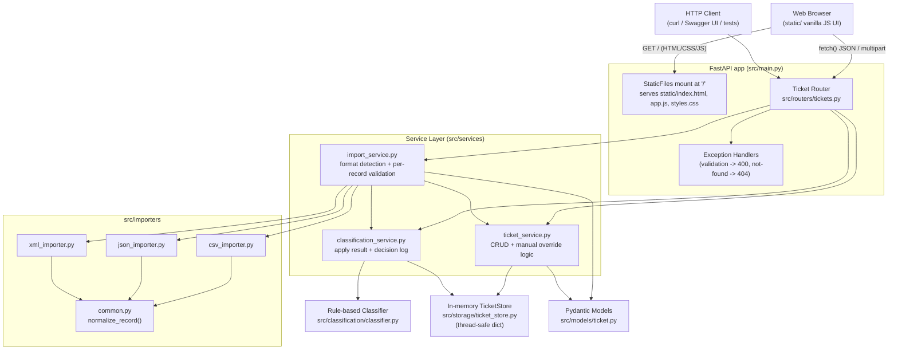

# Homework 2: Intelligent Customer Support System

> **Student Name**: Kostiantyn Tkachenko
> **Date Submitted**: 2026-07-04
> **AI Tools Used**: Cursor (Claude Sonnet 5, OpenAI GPT-5.5)

## Overview

A Python/FastAPI backend (plus a vanilla HTML/CSS/JS front-end) for a customer
support ticket management system. It supports creating tickets one at a time
or in bulk from **CSV, JSON, or XML** files, automatically categorizes and
prioritizes tickets using a deterministic, rule-based classifier, and exposes
full CRUD + filtering over an in-memory ticket store. Agents can manage
tickets either through the REST API directly or through the built-in web UI.
The project ships with an 89-test pytest suite at **99% statement coverage**.

## Features

- **Ticket CRUD** — create, read, update, delete, and list (with filtering +
  pagination) support tickets.
- **Multi-format bulk import** — upload `.csv`, `.json`, or `.xml` files;
  each record is validated independently, so one bad row never fails the
  whole import. Returns a `{total, successful, failed, errors[]}` summary.
- **Rule-based auto-classification** — categorizes tickets
  (`account_access`, `technical_issue`, `billing_question`, `feature_request`,
  `bug_report`, `other`) and assigns a priority (`urgent`, `high`, `medium`,
  `low`) from keyword matches, with a confidence score, human-readable
  reasoning, and the matched keywords. Can run automatically on
  creation/import (`?auto_classify=true`) or on demand
  (`POST /tickets/{id}/auto-classify`). Manual overrides via `PUT` are
  tracked separately from auto-classified results.
- **In-memory, thread-safe storage** — no database setup required; a
  `threading.Lock`-guarded store keeps concurrent requests safe.
- **Web front-end** — a single-page vanilla HTML/CSS/JavaScript UI (`static/`)
  served directly by FastAPI at `/`. Lets agents list/filter tickets, create
  and edit them with client-side validation, view full details (including
  classification and metadata), trigger auto-classification, and bulk-import
  files — all backed by the live REST API (no hardcoded data), with a
  responsive layout for desktop and mobile.

## Architecture



See [ARCHITECTURE.md](ARCHITECTURE.md) for component details, sequence
diagrams, and design trade-offs.

## Installation & Setup

Requires Python 3.11+. See [HOWTORUN.md](HOWTORUN.md) for full step-by-step
instructions (Windows PowerShell **and** macOS/Linux bash). Quick start:

**Windows (PowerShell):**

```powershell
cd homework-2
python -m venv .venv
.\.venv\Scripts\Activate.ps1
pip install -r requirements.txt
.\.venv\Scripts\python.exe -m uvicorn src.main:app --reload
```

**macOS / Linux (bash/zsh):**

```bash
cd homework-2
python3 -m venv .venv
source .venv/bin/activate
pip install -r requirements.txt
python -m uvicorn src.main:app --reload
```

The API is now available at `http://127.0.0.1:8000`, with interactive docs at
`http://127.0.0.1:8000/docs`. The **web UI** is served at the same address —
open `http://127.0.0.1:8000/` in a browser to manage tickets visually.

## Running Tests

```powershell
.\.venv\Scripts\python.exe -m pytest    # Windows
```

```bash
python -m pytest                        # macOS / Linux
```

This runs all 89 tests and prints a coverage report (configured in
[pytest.ini](pytest.ini) to fail if coverage drops below 85%; current
coverage is ~99%). See [TESTING_GUIDE.md](TESTING_GUIDE.md) for details,
including how to view the HTML coverage report.

## Project Structure

```
homework-2/
├── requirements.txt
├── pytest.ini
├── conftest.py                      # makes `src` importable regardless of invocation cwd
├── README.md / HOWTORUN.md / API_REFERENCE.md / ARCHITECTURE.md / TESTING_GUIDE.md
├── src/
│   ├── main.py                      # FastAPI app, /health, exception handlers
│   ├── models/ticket.py             # Enums + Pydantic schemas
│   ├── storage/ticket_store.py      # Thread-safe in-memory repository
│   ├── routers/tickets.py           # All /tickets HTTP endpoints
│   ├── importers/                   # csv_importer.py, json_importer.py, xml_importer.py, common.py
│   ├── classification/classifier.py # Rule-based category + priority classifier
│   ├── services/                    # ticket_service, import_service, classification_service
│   └── exceptions.py
├── static/                          # Web front-end (vanilla HTML/CSS/JS), mounted at "/"
│   ├── index.html
│   ├── styles.css
│   └── app.js
├── tests/
│   ├── conftest.py                  # shared fixtures (client, store reset)
│   ├── test_ticket_model.py         # Pydantic schema validation
│   ├── test_ticket_api.py           # CRUD endpoint tests
│   ├── test_import_csv.py / test_import_json.py / test_import_xml.py
│   ├── test_import_service.py       # format detection + file-level error handling
│   ├── test_categorization.py       # classifier + auto-classify endpoint
│   ├── test_frontend_static.py      # static front-end mount + route precedence
│   ├── test_integration.py          # end-to-end workflows
│   ├── test_performance.py          # timing benchmarks
│   └── fixtures/                    # valid/invalid/malformed sample files
├── scripts/generate_sample_data.py  # regenerates demo/ sample data deterministically
├── demo/                            # deliverable sample data (50 csv / 20 json / 30 xml + invalid)
└── docs/screenshots/                # test_coverage.png, ui.png
```

## AI Tools Used

Built with [Cursor](https://cursor.com) using Claude models, following the
Context-Model-Prompt framework: FastAPI + Pydantic + in-memory storage was
chosen with the user, then implemented phase-by-phase (API → classification →
tests → docs → integration/performance → sample data), verifying behavior
with manual smoke tests and the pytest suite after each phase.

<div align="center">

*This project was completed as part of the AI-Assisted Development course.*

</div>
