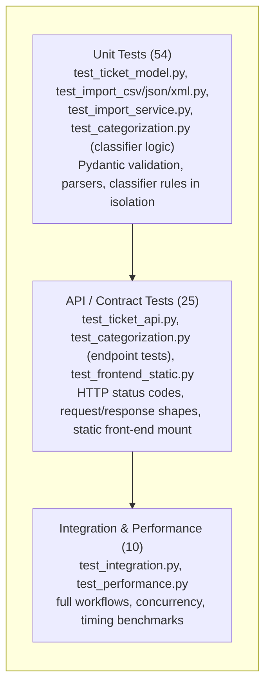

# Testing Guide

Audience: QA engineers verifying test coverage and manually exercising the API.

## Test Pyramid



*(Counts reflect the current suite of 89 tests; see the breakdown table below.)*

## Running Tests

From the `homework-2/` directory, with the virtual environment set up (see
[HOWTORUN.md](HOWTORUN.md)):

```powershell
.\.venv\Scripts\python.exe -m pytest    # Windows
```

```bash
python -m pytest                        # macOS / Linux
```

This runs all tests with coverage enabled (`pytest.ini` sets
`--cov=src --cov-report=term-missing --cov-report=html --cov-fail-under=85`).

Useful variants (Windows shown; swap `.\.venv\Scripts\python.exe` for
`python` on macOS/Linux):

```powershell
# Run one file
.\.venv\Scripts\python.exe -m pytest tests/test_categorization.py

# Show print() output (used by the performance tests to report timings)
.\.venv\Scripts\python.exe -m pytest -s tests/test_performance.py

# Open the HTML coverage report after a run
start htmlcov/index.html   # Windows; use `open` (macOS) or `xdg-open` (Linux)
```

## Test Suite Breakdown

| File | Focus | Tests |
|---|---|---|
| `test_ticket_model.py` | Pydantic `TicketCreate` schema validation (email, string lengths, enums, defaults) | 10 |
| `test_ticket_api.py` | CRUD endpoints, filtering, pagination, health check, store internals | 16 |
| `test_import_csv.py` | CSV parsing (valid, tags, metadata columns, empty file, invalid UTF-8) + import endpoint | 7 |
| `test_import_json.py` | JSON parsing (array/`tickets` key, malformed, empty, invalid shapes) + import endpoint | 9 |
| `test_import_xml.py` | XML parsing (valid, tag lists, flatten edge cases, malformed, missing elements) + import endpoint | 11 |
| `test_import_service.py` | Format detection by extension/content-type, unsupported format, whole-file errors via the endpoint | 5 |
| `test_categorization.py` | Classifier rules (category + priority keywords, defaults, confidence bounds) + auto-classify endpoint, manual override | 15 |
| `test_frontend_static.py` | Static front-end mount: `index.html`/JS/CSS served, unknown paths 404, `/health`/`/tickets` still resolve over the catch-all mount | 6 |
| `test_integration.py` | Full ticket lifecycle, bulk import + classification verification, 25 concurrent creates, combined filtering, import→filter→delete workflow | 5 |
| `test_performance.py` | Timing benchmarks for creation, listing, bulk import, classification, and concurrency | 5 |
| **Total** | | **89** |

Current coverage: **99%** (well above the required 85%; see
`docs/screenshots/test_coverage.png` for a screenshot of a local run).

## Sample Test Data Locations

- `tests/fixtures/` — small, focused fixtures used by unit tests: valid and
  invalid records per format, empty files, malformed syntax, and XML
  edge cases (attributes, mixed content, empty elements).
- `demo/` — the deliverable sample datasets: `sample_tickets.csv` (50),
  `sample_tickets.json` (20), `sample_tickets.xml` (30), and
  `invalid_sample_tickets.{csv,json,xml}` (5 deliberately-broken records
  each, covering bad email, too-short description, invalid category/priority
  enum, and a missing required field). Regenerate deterministically with:

  ```powershell
  .\.venv\Scripts\python.exe scripts\generate_sample_data.py   # Windows
  ```

  ```bash
  python scripts/generate_sample_data.py                        # macOS / Linux
  ```

## Manual Testing Checklist

With the server running (`uvicorn src.main:app --reload`), verify via
`/docs` (Swagger UI) or `curl`:

- [ ] `GET /health` returns `{"status": "ok"}`
- [ ] `POST /tickets` with a valid payload returns `201` with a generated `id`
- [ ] `POST /tickets` with an invalid email / too-short description returns
      `400` with field-level `details`
- [ ] `POST /tickets?auto_classify=true` returns a ticket with a populated
      `classification` object
- [ ] `POST /tickets/import` with `demo/sample_tickets.csv` reports
      `successful: 50, failed: 0`
- [ ] `POST /tickets/import` with `demo/invalid_sample_tickets.csv` reports
      `successful: 0, failed: 5` with meaningful per-record `errors`
- [ ] `POST /tickets/import` with a `.txt` file returns `400`
      ("Unsupported file format")
- [ ] `GET /tickets?category=billing_question&priority=high` returns only
      matching tickets
- [ ] `POST /tickets/{id}/auto-classify` updates `category`/`priority` and
      returns `confidence`, `reasoning`, `keywords_found`
- [ ] `PUT /tickets/{id}` with `category`/`priority` sets
      `classification.manually_overridden: true`
- [ ] `DELETE /tickets/{id}` returns `204`, and a subsequent `GET` returns `404`

**Front-end (`http://127.0.0.1:8000/`):**

- [ ] Ticket list loads real data from `GET /tickets` (no hardcoded rows)
- [ ] Category/priority/status/customer filters narrow the list correctly
- [ ] "New Ticket" form rejects invalid email / too-short description
      client-side before hitting the API
- [ ] Creating/editing/deleting a ticket updates the list without a full
      page reload
- [ ] "Classify" shows category, priority, confidence, and reasoning inline
- [ ] "Bulk Import" reports the `{total, successful, failed, errors[]}`
      summary for a sample file
- [ ] Layout reflows into stacked cards on a narrow (mobile-width) viewport

## Performance Benchmarks

Measured locally on a development machine via `pytest -s tests/test_performance.py`
(thresholds in the test file are set generously above these to avoid flakiness
on slower CI machines):

| Benchmark | Result | Threshold |
|---|---|---|
| Single ticket creation (avg of 100) | 4.4 ms | < 50 ms |
| List 1,000 tickets (`GET /tickets`) | 11.1 ms | < 500 ms |
| Bulk import of 200 tickets (CSV) | 66.6 ms (~3,000 tickets/sec) | < 2,000 ms |
| Classification latency (avg of 1,000 calls) | 36.8 µs | < 1,000 µs |
| 25 concurrent ticket creations (10 workers) | 345 ms (~145 req/sec) | < 5,000 ms |

Re-run with `-s` any time to reproduce these numbers on your own machine —
exact figures will vary by hardware, but should be well within the
thresholds above given the in-memory store.
