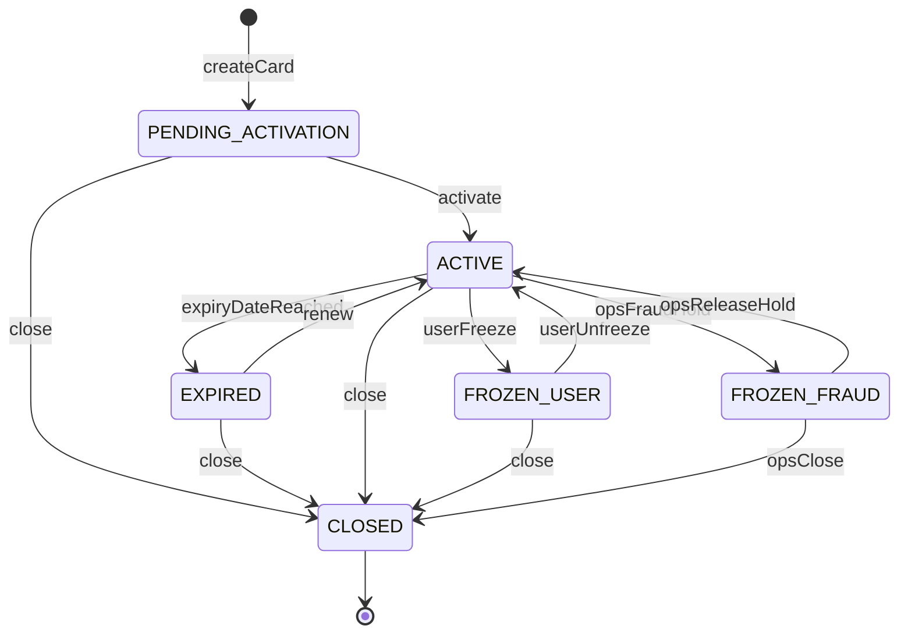

# Virtual Payment Card Lifecycle Specification

> Ingest the information from this file, implement the Low-Level Tasks, and generate the code that will satisfy the High and Mid-Level Objectives.

## Assumptions

| Assumption | Value |
|------------|-------|
| Persona | Personal use only — one end-user owns and manages their own virtual card(s) |
| Funding model | Prepaid/debit against a linked internal **wallet balance** (not credit line, not external bank pass-through) |
| Card network | Visa or Mastercard virtual debit (implementation detail; spec is network-agnostic) |
| Currency | Single wallet currency per user at card creation (ISO 4217, e.g. `USD`) |
| Tech stack (when implemented) | Go backend per `AGENTS.md`; this homework deliverable is **specification only** |

## High-Level Objective

Enable a KYC-verified end-user to self-serve the full lifecycle of a virtual payment card—create, activate, control spending, freeze, view activity, manage PIN and notifications, and close or replace the card—while internal ops/compliance retain fraud-hold override, immutable audit visibility, and dispute intake, all within a regulated FinTech environment.

**Scope boundary:** Virtual card lifecycle for a single personal account holder; no business multi-user issuance, no digital-wallet tokenization (Apple/Google Pay), no physical card conversion, no cross-border FX.

---

## Mid-Level Objectives

Each objective is **observable** and maps to low-level tasks below.

| ID | Objective | Success signal |
|----|-----------|----------------|
| **MO-1** | **Eligible card issuance** — A KYC-verified user with an active wallet can create a virtual card that appears in `PENDING_ACTIVATION` within the creation latency budget | Card record exists; wallet link established; user sees masked last-four only |
| **MO-2** | **Explicit activation** — User must activate before first authorization | Authorizations rejected until activation; activation emits audit event |
| **MO-3** | **Secure detail reveal** — Full PAN/CVV available only via short-lived, rate-limited reveal; default view is masked | Reveal token expires; PAN never appears in logs or persistent non-vault storage |
| **MO-4** | **User freeze/unfreeze** — User can freeze and unfreeze their own card | New authorizations blocked within propagation SLA when frozen by user |
| **MO-5** | **Ops fraud hold** — Ops/compliance can place a fraud hold the user cannot self-lift | User unfreeze rejected; ops release requires elevated role + audit |
| **MO-6** | **Spending limits** — User can set daily, monthly, per-transaction, and optional merchant-category limits | Declines when limit exceeded; counters reconcile with ledger |
| **MO-7** | **Transaction history** — User can paginated-list card transactions with status, amount, merchant, timestamp | Empty state when no txns; 90-day default window; sort newest-first |
| **MO-8** | **Rename card** — User can set a display name (e.g. "Subscriptions") | Name change reflected immediately; audit logged |
| **MO-9** | **Close card** — User can permanently close (soft-delete) a card | Closed card rejects all new activity; history retained |
| **MO-10** | **Transaction notifications** — User configures push/email/SMS alerts per card | Notification dispatched within dispatch SLA after settled/posted txn |
| **MO-11** | **PIN lifecycle** — User can set initial PIN, change PIN, and reset PIN with lockout on failed attempts | PIN stored only in HSM/vault; lockout after N failures |
| **MO-12** | **Card reissue** — User can replace a lost/compromised card with a new PAN | Old PAN retired; txn history preserved under card lineage |
| **MO-13** | **Expiration & renewal** — Cards expire on schedule; user may renew before expiry | Expired card blocks auth; renewal creates successor or extends per policy |
| **MO-14** | **Dispute intake** — User can flag a transaction for dispute from history | Dispute case created; txn marked `DISPUTED`; resolution out of scope |
| **MO-15** | **Immutable audit trail** — Every lifecycle mutation produces an append-only audit record for ops/compliance | Ops can query by card, user, actor, action, time range |

---

## Non-Functional Requirements & Policy

### Security

- **PCI scope reduction:** Store only tokenized PAN reference and last-four digits in application DB; full PAN/CVV in PCI-compliant vault/HSM only.
- **Zero-trust logging:** Never log PAN, CVV, PIN, or raw reveal tokens (per `AGENTS.md`).
- **Encryption:** Data at rest encrypted (AES-256 or equivalent); TLS 1.2+ in transit.
- **Authentication:** All user endpoints require authenticated session or OAuth2 bearer token scoped to `cards:read`, `cards:write` as appropriate.
- **Authorization:** User may only access cards where `card.owner_user_id == authenticated_user_id`. Ops endpoints require `ops:cards:admin` or `compliance:fraud:hold`.
- **Reveal hardening:** Card detail reveal requires step-up auth (e.g. OTP or biometric) and is rate-limited (see Performance).

### Privacy

- PII minimization in audit exports: mask email/phone in user-facing logs; full identity only in compliance tooling with role gate.
- Retention: transaction and audit records retained minimum 7 years (regulatory assumption, configurable).

### Audit & Compliance

- **Immutable audit log:** Append-only; no UPDATE/DELETE on audit rows.
- **Required fields:** `audit_id`, `actor_id`, `actor_type` (`user` \| `ops` \| `system`), `timestamp` (UTC RFC 3339), `action`, `resource_type`, `resource_id`, `previous_state` (JSON snapshot), `new_state` (JSON snapshot), `correlation_id`.
- **Dual control (assumed):** Releasing a fraud hold may require two ops approvers in production (documented; single approver acceptable in dev).

### Reliability

- **Idempotency:** All mutating API operations accept `Idempotency-Key` header; duplicate requests return same result without duplicate side effects within 24h window.
- **At-least-once delivery:** Notification and audit writes use outbox pattern or equivalent; consumers must be idempotent.
- **Authorization path consistency:** Card status changes must propagate to authorization decision engine within propagation SLA (see Performance).

### Performance (summary — detail in dedicated section)

Assumed targets labeled for a consumer FinTech UX; adjust per production SLO review.

| Operation | Target (p95) |
|-----------|----------------|
| Create card | < 1s |
| Activate / freeze / unfreeze | < 500ms API; < 2s auth propagation |
| List transactions (50 items) | < 500ms |
| Set limits / rename | < 300ms |
| Notification after txn post | < 5s |

---

## Implementation Notes

### Money & amounts

- Use arbitrary-precision decimal (e.g. `github.com/shopspring/decimal` in Go); **never** `float64`.
- Amounts stored as string decimal + currency code pair: `{ "amount": "125.50", "currency": "USD" }`.
- Rounding: explicit banker's rounding when aggregating limit counters.

### Time

- All timestamps UTC; JSON serialization RFC 3339 (`2026-07-10T14:30:00Z`).
- Limit windows: daily = UTC calendar day; monthly = UTC calendar month (document in API).

### Identifiers

| Entity | Format | Example |
|--------|--------|---------|
| Card | `card_<ulid>` | `card_01JABC...` |
| Wallet link | `wallet_<ulid>` | pre-existing |
| Transaction | `txn_<ulid>` | |
| Audit event | `aud_<ulid>` | |
| Dispute case | `dsp_<ulid>` | |
| Idempotency key | Client UUID v4 | |

### Display conventions

- Masked PAN: `**** **** **** 1234` (last four only).
- Card status enum: `PENDING_ACTIVATION`, `ACTIVE`, `FROZEN_USER`, `FROZEN_FRAUD`, `EXPIRED`, `CLOSED`.
- Freeze reason stored separately when `FROZEN_*`.

### Error taxonomy

| Code | HTTP | When |
|------|------|------|
| `VALIDATION_ERROR` | 400 | Invalid input (negative limit, bad PIN format) |
| `UNAUTHORIZED` | 401 | Missing/invalid auth |
| `FORBIDDEN` | 403 | Wrong owner or insufficient role |
| `NOT_FOUND` | 404 | Card/txn not found or not owned |
| `CONFLICT` | 409 | Idempotent replay mismatch, illegal state transition |
| `POLICY_DENIED` | 422 | KYC incomplete, max cards reached, fraud hold blocks unfreeze |
| `RATE_LIMITED` | 429 | Reveal/PIN/create rate exceeded |
| `INTERNAL_ERROR` | 500 | Unexpected failure (no sensitive detail in response) |

### Idempotency

- Required on: `POST /cards`, `POST /cards/{id}/activate`, `POST /cards/{id}/freeze`, `POST /cards/{id}/unfreeze`, `POST /cards/{id}/close`, `POST /cards/{id}/reissue`, `PUT /cards/{id}/limits`, `PUT /cards/{id}/pin`.
- Store `(user_id, idempotency_key) → response` for 24h.

### Integration contracts (hypothetical)

- **Wallet service:** Reserve/debit on authorization; release on decline/timeout; capture on settlement.
- **KYC service:** `GET /users/{id}/kyc-status` → `VERIFIED` required for issuance.
- **Card processor:** Issue virtual PAN, forward auth webhooks, handle PIN in processor vault.
- **Notification service:** `POST /notifications` with template id + payload (no PAN in payload).

---

## Context

### Beginning context

Pre-existing platform components (hypothetical):

| Component | State |
|-----------|-------|
| User identity & auth | Users exist; OAuth2/session auth works |
| KYC | Users may be `PENDING`, `VERIFIED`, or `REJECTED` |
| Wallet | One wallet per user with available balance in single currency |
| Ledger | Append-only ledger for wallet movements |
| Notification service | Email/push/SMS channels configured |
| Ops portal shell | Authenticated ops UI exists; no card modules yet |
| Database | PostgreSQL (assumed) with migration tooling |
| No card domain | No `cards`, `card_limits`, `card_audit`, or `disputes` tables |

### Ending context

After full implementation of this spec (hypothetical):

| Artifact | Description |
|----------|-------------|
| Card service module | Domain logic for lifecycle, limits, state machine |
| REST (or gRPC) API | User-facing card endpoints + ops fraud-hold endpoints |
| Persistence | Tables: `cards`, `card_limits`, `card_limit_counters`, `card_transactions`, `card_audit_events`, `card_disputes`, `idempotency_keys` |
| Authorization adapter | Webhook/handler consulting card status + limits before wallet debit |
| PIN integration | Processor or HSM adapter; no PIN in app DB |
| Notification hooks | Subscribers on txn post and optional limit-threshold events |
| Ops audit UI/API | Query/filter audit trail and fraud holds |
| Test suite | Unit, integration, contract tests per Verification section |
| OpenAPI spec | Generated or hand-maintained API documentation |

---

## Card State Machine

### State transition table

| From | To | Trigger | Actor | Preconditions | Audit action |
|------|-----|---------|-------|---------------|--------------|
| — | `PENDING_ACTIVATION` | Create card | User | KYC verified, wallet active, under max card count | `CARD_CREATED` |
| `PENDING_ACTIVATION` | `ACTIVE` | Activate | User | — | `CARD_ACTIVATED` |
| `ACTIVE` | `FROZEN_USER` | Freeze | User | — | `CARD_FROZEN_USER` |
| `FROZEN_USER` | `ACTIVE` | Unfreeze | User | Not `FROZEN_FRAUD` | `CARD_UNFROZEN_USER` |
| `ACTIVE` | `FROZEN_FRAUD` | Fraud hold | Ops | Case/ticket reference optional | `CARD_FROZEN_FRAUD` |
| `FROZEN_FRAUD` | `ACTIVE` | Release hold | Ops | Elevated role; dual control in prod | `CARD_FRAUD_HOLD_RELEASED` |
| `ACTIVE` | `EXPIRED` | Scheduler | System | `now >= expires_at` | `CARD_EXPIRED` |
| `EXPIRED` | `ACTIVE` | Renew | User | Within renewal window | `CARD_RENEWED` |
| `*` (not CLOSED) | `CLOSED` | Close | User/Ops | No blocking unsettled txns policy (see edge cases) | `CARD_CLOSED` |
| `ACTIVE` | new card | Reissue | User | Old card → `CLOSED`, new → `PENDING_ACTIVATION` | `CARD_REISSUED` |

**Note:** `FROZEN_FRAUD` and `FROZEN_USER` are distinct statuses (not a single `FROZEN` with a flag) so authorization and UI never ambiguously allow user unfreeze during fraud hold.

---

## Low-Level Tasks

Tasks reference mid-level objectives (MO-*). Acceptance criteria appear on representative tasks; all tasks inherit global non-functional requirements.

### Group A — Issuance & Activation (MO-1, MO-2, MO-3)

#### Task A1 — KYC and wallet eligibility gate
- **Serves:** MO-1
- **Action:** Before card creation, call KYC service and wallet service; reject if KYC ≠ `VERIFIED` or wallet missing/inactive.
- **Acceptance:** Returns `POLICY_DENIED` with clear message when KYC pending; no card row created.

#### Task A2 — Enforce per-user active card limit
- **Serves:** MO-1
- **Action:** Count cards in `PENDING_ACTIVATION`, `ACTIVE`, `FROZEN_USER`, `FROZEN_FRAUD`, `EXPIRED` (not `CLOSED`); reject create if count ≥ 5 (configurable constant).
- **Acceptance:** Sixth create attempt returns `POLICY_DENIED`; count excludes `CLOSED`.

#### Task A3 — Create virtual card record
- **Serves:** MO-1
- **Action:** Call processor to issue PAN; persist `card_*` with `status=PENDING_ACTIVATION`, `wallet_id`, `last_four`, `expires_at` (+3 years default), `display_name` default "Virtual Card".
- **Acceptance:** Idempotent create returns same card on replay; audit `CARD_CREATED` emitted.

#### Task A4 — Link card to wallet for debits
- **Serves:** MO-1
- **Action:** Register funding source mapping `card_id → wallet_id` in authorization adapter.
- **Acceptance:** Integration test confirms auth webhook resolves wallet.

#### Task A5 — Activate card endpoint
- **Serves:** MO-2
- **Action:** Transition `PENDING_ACTIVATION → ACTIVE`; reject if not pending.
- **Acceptance:** Post-activation, test authorization succeeds (stub); audit `CARD_ACTIVATED`.

#### Task A6 — Block auth until activated
- **Serves:** MO-2
- **Action:** Authorization handler declines with reason `CARD_NOT_ACTIVATED` when status is `PENDING_ACTIVATION`.
- **Acceptance:** Table-driven tests for all non-ACTIVE statuses.

#### Task A7 — Masked card summary API
- **Serves:** MO-3
- **Action:** `GET /cards/{id}` returns last_four, expiry month/year, status, display_name, limits summary — never full PAN/CVV.
- **Acceptance:** Response schema validated; no PAN field in OpenAPI.

#### Task A8 — Secure reveal endpoint
- **Serves:** MO-3
- **Action:** `POST /cards/{id}/reveal` after step-up auth; returns full PAN + CVV once; short-lived (60s) in-memory only on client guidance; rate limit 3/hour/card.
- **Acceptance:** 429 on exceed; audit `CARD_DETAILS_REVEALED` without PAN in payload.

---

### Group B — Freeze & Fraud Hold (MO-4, MO-5)

#### Task B1 — User freeze
- **Serves:** MO-4
- **Action:** `POST /cards/{id}/freeze` → `FROZEN_USER`; idempotent.
- **Acceptance:** Audit logged; subsequent auth declined `CARD_FROZEN`.

#### Task B2 — User unfreeze
- **Serves:** MO-4
- **Action:** `POST /cards/{id}/unfreeze` only from `FROZEN_USER`.
- **Acceptance:** From `FROZEN_FRAUD`, returns `POLICY_DENIED`.

#### Task B3 — Propagate freeze to authorization path
- **Serves:** MO-4, MO-5
- **Action:** Push status to auth cache/subscriber; target propagation < 2s p95.
- **Acceptance:** Integration test: freeze then immediate auth attempt declined.

#### Task B4 — Ops fraud hold API
- **Serves:** MO-5
- **Action:** `POST /ops/cards/{id}/fraud-hold` → `FROZEN_FRAUD`; requires ops role.
- **Acceptance:** User unfreeze fails; audit includes ops `actor_id`.

#### Task B5 — Ops release fraud hold
- **Serves:** MO-5
- **Action:** `POST /ops/cards/{id}/release-fraud-hold` → `ACTIVE`.
- **Acceptance:** Dual-control flag documented; audit `CARD_FRAUD_HOLD_RELEASED`.

---

### Group C — Spending Limits (MO-6)

#### Task C1 — Limits data model
- **Serves:** MO-6
- **Action:** Store optional `daily_limit`, `monthly_limit`, `per_txn_limit`, `category_limits` (map MCC → amount) per card in wallet currency.
- **Acceptance:** Null limit means unlimited for that dimension.

#### Task C2 — Set/update limits API
- **Serves:** MO-6
- **Action:** `PUT /cards/{id}/limits` validates non-negative decimals, per-txn ≤ daily ≤ monthly when all set.
- **Acceptance:** Rejects negative; audit `LIMITS_UPDATED` with previous/new JSON.

#### Task C3 — Limit counter service
- **Serves:** MO-6
- **Action:** Maintain rolling daily/monthly spend counters per card; reset at UTC boundaries.
- **Acceptance:** Unit tests for boundary reset at midnight UTC.

#### Task C4 — Authorization limit check
- **Serves:** MO-6
- **Action:** On auth request, check per-txn, daily, monthly, category; decline `LIMIT_EXCEEDED` with which limit hit.
- **Acceptance:** Table-driven tests for each limit type and partial approval (if supported: spec assumes full decline only).

#### Task C5 — Limit counter reconciliation job
- **Serves:** MO-6
- **Action:** Nightly job compares counters to sum of settled txns; alert on drift > 0.
- **Acceptance:** Reconciliation report fixture in integration tests.

---

### Group D — Transactions (MO-7, MO-14)

#### Task D1 — Ingest authorization/settlement events
- **Serves:** MO-7
- **Action:** Webhook from processor creates/updates `card_transactions` with status `PENDING`, `SETTLED`, `DECLINED`, `REVERSED`.
- **Acceptance:** Idempotent on processor event id.

#### Task D2 — List transactions API
- **Serves:** MO-7
- **Action:** `GET /cards/{id}/transactions?from=&to=&cursor=` default last 90 days, page size 50, sort `-created_at`.
- **Acceptance:** Empty array + friendly message when none; p95 < 500ms with index on `(card_id, created_at)`.

#### Task D3 — Transaction detail API
- **Serves:** MO-7
- **Action:** `GET /cards/{id}/transactions/{txn_id}` includes merchant name, MCC, amount, status, decline reason if any.
- **Acceptance:** 404 if txn not on card.

#### Task D4 — Dispute initiation
- **Serves:** MO-14
- **Action:** `POST /cards/{id}/transactions/{txn_id}/dispute` with reason code + optional note; creates `dsp_*`, marks txn `DISPUTED`.
- **Acceptance:** Duplicate dispute returns existing case; audit `DISPUTE_OPENED`.

---

### Group E — Rename & Close (MO-8, MO-9)

#### Task E1 — Rename card
- **Serves:** MO-8
- **Action:** `PATCH /cards/{id}` with `display_name` (1–64 chars, sanitized).
- **Acceptance:** Immediate read-after-write; audit `CARD_RENAMED`.

#### Task E2 — Close card (delete)
- **Serves:** MO-9
- **Action:** `POST /cards/{id}/close` → `CLOSED` soft-delete; irreversible for user.
- **Acceptance:** Closed card excluded from active count; auth declined; history retained.

#### Task E3 — Close preconditions
- **Serves:** MO-9
- **Action:** If unsettled authorizations exist, either block close or allow with warning policy — **spec decision:** block close while any `PENDING` txn exists; user must wait settlement or contact support.
- **Acceptance:** Test close with pending auth returns `CONFLICT`.

---

### Group F — Notifications (MO-10)

#### Task F1 — Notification preferences model
- **Serves:** MO-10
- **Action:** Per card: channels (`email`, `push`, `sms`), enabled flags, optional minimum amount threshold.
- **Acceptance:** Default all channels off until user opts in (regulatory-friendly default).

#### Task F2 — Update notification preferences API
- **Serves:** MO-10
- **Action:** `PUT /cards/{id}/notification-preferences`.
- **Acceptance:** Audit `NOTIFICATION_PREFS_UPDATED`.

#### Task F3 — Dispatch on settled transaction
- **Serves:** MO-10
- **Action:** On txn → `SETTLED`, enqueue notification with masked last-four, amount, merchant — no PAN.
- **Acceptance:** p95 dispatch < 5s from settlement event in integration test.

#### Task F4 — Notification retry policy
- **Serves:** MO-10
- **Action:** Failed delivery retry 3x exponential backoff; dead-letter queue for ops review.
- **Acceptance:** Idempotent notification id prevents duplicate SMS.

---

### Group G — PIN Management (MO-11)

#### Task G1 — Set initial PIN
- **Serves:** MO-11
- **Action:** `PUT /cards/{id}/pin` allowed only once before first PIN set or in `PENDING_ACTIVATION`; validate 4-digit numeric (configurable 4–6).
- **Acceptance:** PIN never in request logs; forwarded to processor vault only.

#### Task G2 — Change PIN
- **Serves:** MO-11
- **Action:** Requires current PIN verification; `PIN_CHANGED` audit.
- **Acceptance:** Wrong current PIN increments failure counter.

#### Task G3 — Reset PIN flow
- **Serves:** MO-11
- **Action:** Step-up auth (OTP) then set new PIN without current PIN.
- **Acceptance:** Audit `PIN_RESET`.

#### Task G4 — PIN lockout
- **Serves:** MO-11
- **Action:** After 5 failed attempts, lock PIN changes for 30 minutes; return `RATE_LIMITED`.
- **Acceptance:** Lockout timer tested with injected clock.

---

### Group H — Reissue & Expiration (MO-12, MO-13)

#### Task H1 — Reissue card
- **Serves:** MO-12
- **Action:** Close old card, create new `PENDING_ACTIVATION` with `replaces_card_id` lineage; copy limits and notification prefs optionally.
- **Acceptance:** Old PAN dead at processor; audit `CARD_REISSUED` links old/new ids.

#### Task H2 — Expiration scheduler
- **Serves:** MO-13
- **Action:** Daily job sets `ACTIVE → EXPIRED` when `expires_at` passed; notify user 30/7/1 days before.
- **Acceptance:** Expired card auth declined `CARD_EXPIRED`.

#### Task H3 — Renew card
- **Serves:** MO-13
- **Action:** `POST /cards/{id}/renew` from `EXPIRED` or within 60 days before expiry extends `expires_at` +3 years, status → `ACTIVE`.
- **Acceptance:** Audit `CARD_RENEWED`; processor expiry updated.

---

### Group I — Audit & Ops (MO-15)

#### Task I1 — Audit event writer
- **Serves:** MO-15
- **Action:** Central helper `RecordAudit(ctx, event)` called from all mutators; append-only insert.
- **Acceptance:** No code path mutates card without audit in review checklist.

#### Task I2 — Ops audit query API
- **Serves:** MO-15
- **Action:** `GET /ops/audit?card_id=&user_id=&action=&from=&to=` paginated.
- **Acceptance:** Ops role required; export CSV without PAN.

#### Task I3 — User-facing activity log (optional subset)
- **Serves:** MO-15
- **Action:** User sees non-sensitive events (freeze, rename, limit change) without ops fraud notes.
- **Acceptance:** Fraud hold reason internal-only field.

---

## Edge Cases & Failure Modes

| # | Trigger | Expected user-visible behavior | Audit / compliance implication |
|---|---------|-------------------------------|--------------------------------|
| E1 | User freezes card during in-flight authorization | Authorization that started before freeze may still approve (network race); authorizations after freeze decline | Log both freeze timestamp and auth timestamp for dispute |
| E2 | User lowers daily limit below already-spent amount today | New auths decline until next UTC day or limit raised | `LIMITS_UPDATED` with previous/new; no retroactive decline of settled txns |
| E3 | User lowers limit below pending auth hold amount | Pending auth may still capture if approved before limit change; new auths checked against remaining headroom | Reconciliation may show temporary over-limit if hold captures — document as processor behavior |
| E4 | Close card with pending unsettled txn | Close rejected with `CONFLICT` and message to wait | No `CARD_CLOSED` event |
| E5 | Duplicate create with same idempotency key | Same card returned, HTTP 200/201 consistent | Single `CARD_CREATED` |
| E6 | Duplicate create with different idempotency key, at max cards | `POLICY_DENIED` | No new card |
| E7 | User attempts unfreeze during fraud hold | `POLICY_DENIED` "Contact support" | Log failed unfreeze attempt (fraud signal) |
| E8 | PIN lockout exhausted | PIN change rejected for 30 min | `PIN_LOCKOUT` audit |
| E9 | Reissue while dispute open on old card | Allow reissue; dispute remains tied to original txn and closed card id | Lineage preserved in dispute record |
| E10 | Notification delivery fails permanently | User sees txn in app; notification marked failed in ops DLQ | No retry of financial posting; ops may contact user |
| E11 | Zero or negative limit submitted | `VALIDATION_ERROR` | No state change |
| E12 | Stale read after self-initiated freeze | Read-after-write: user's own freeze visible within 1s | — |
| E13 | Card expires during active subscription auth | Merchant retry may fail after expiry; user notified to renew | `CARD_EXPIRED` |
| E14 | Wallet insufficient funds at auth | Decline `INSUFFICIENT_FUNDS` regardless of card limits | Ledger no hold placed |
| E15 | KYC revoked after card issued | Existing card may continue or be frozen by policy — **spec decision:** ops fraud-freeze all cards when KYC → `REJECTED` | System-initiated `CARD_FROZEN_FRAUD` |
| E16 | Concurrent limit update and auth | Serializable transaction or version column; one wins deterministically | Audit order reflects commit order |
| E17 | Reveal rate limit exceeded | HTTP 429; no PAN returned | Audit reveal attempt |

---

## Verification

### Mapping mid-level objectives to verification methods

| Objective | Unit tests | Integration tests | E2E / manual | Reconciliation / other |
|-----------|------------|-------------------|--------------|------------------------|
| MO-1 | Eligibility rules, idempotency | Create with KYC mock + wallet mock | User creates card in staging | — |
| MO-2 | State transition guards | Auth declined pre-activation | Activate then purchase test | — |
| MO-3 | Rate limit logic | Reveal never in logs (log capture) | Step-up auth flow | PCI log review |
| MO-4 | Freeze transition | Auth propagation timing | User freeze in app | — |
| MO-5 | Role checks | Ops hold blocks user unfreeze | Compliance dual-control drill | — |
| MO-6 | Limit math, UTC boundaries | Auth + counter updates | Set limit and attempt purchase | Nightly counter vs ledger |
| MO-7 | Pagination cursors | List with fixtures | — | — |
| MO-8 | Name validation | PATCH round-trip | — | — |
| MO-9 | Close guards | Pending txn block | Close card flow | — |
| MO-10 | Preference defaults | Notification enqueue | Receive push/email in staging | DLQ monitoring |
| MO-11 | Lockout counter | Processor PIN mock | Reset flow with OTP | — |
| MO-12 | Lineage fields | Reissue closes old PAN | — | Processor PAN retirement |
| MO-13 | Expiry job | Renew extends date | — | — |
| MO-14 | Duplicate dispute idempotency | Case creation | — | — |
| MO-15 | Audit helper invoked | Append-only constraint | Ops query export | Immutable store review |

### Test fixtures (minimum)

- User A: KYC verified, wallet $1000 USD
- User B: KYC pending
- User C: verified, 5 active cards (at limit)
- Card fixtures: each status enum
- Transactions: settled, pending, declined, disputed
- Ops actor with `compliance:fraud:hold` role

### Definition of Done (global)

- All tasks for an objective complete
- Table-driven unit tests with `t.Parallel()` per `AGENTS.md`
- No PAN/PIN in test logs
- OpenAPI updated
- Audit events verified for happy and primary error paths

---

## Expected Performance

All values are **assumed targets** for a consumer FinTech MVP; validate in load testing.

| Metric | Target | Rationale |
|--------|--------|-----------|
| Create card API p95 | < 1s | User expects instant card appearance; includes processor round-trip |
| Activate/freeze/unfreeze API p95 | < 500ms | Frequent toggles must feel instant |
| Freeze propagation to auth decision p95 | < 2s | Security-sensitive; user expects near-immediate block |
| List transactions (50 rows) p95 | < 500ms | Standard mobile feed UX |
| Set limits / rename p95 | < 300ms | Simple CRUD |
| Read-after-write (own mutation) p95 | < 1s | User sees freeze/limit change without confusion |
| Notification dispatch after settlement p95 | < 5s | Near-real-time fraud awareness |
| Card reveal | Max 3 per card per hour | Reduce PAN exposure window |
| Card create rate limit | 10 per user per day | Abuse prevention |
| PIN attempts before lockout | 5 failures → 30 min lockout | Industry-aligned card security |
| Pagination default / max | 50 / 100 rows | Mobile payload size |
| Transaction history default window | 90 days | Balance UX vs query cost |
| Idempotency key retention | 24 hours | Standard payment API practice |
| Audit query ops API p95 | < 2s for 30-day range | Compliance investigations |

---

## Out of Scope

- Digital wallet tokenization (Apple Pay / Google Pay provisioning)
- Business / multi-user / employee card programs
- Physical card issuance or conversion
- Cross-border multi-currency FX and DCC
- Full dispute resolution workflow (chargeback processing, provisional credit)
- UI mockups and actual API implementation (this document only)

---

## Traceability Index

| User feature | Mid-level objective | Task groups |
|--------------|---------------------|-------------|
| Create virtual card | MO-1, MO-2 | A |
| Freeze / unfreeze | MO-4, MO-5 | B |
| Spending limits | MO-6 | C |
| View transactions | MO-7 | D |
| Delete (close) card | MO-9 | E |
| Rename card | MO-8 | E |
| Transaction notifications | MO-10 | F |
| Set up PIN | MO-11 | G |
| Replace / reissue | MO-12 | H |
| Expiration & renewal | MO-13 | H |
| Dispute flag | MO-14 | D |
| Ops audit | MO-15 | I |
| Secure PAN reveal | MO-3 | A |
